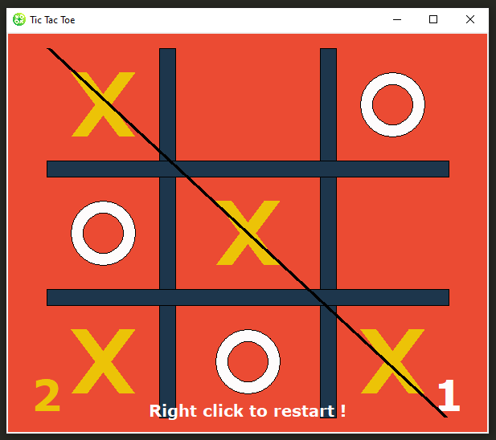

# Tic Tac Toe against CPU with GUI (Tkinter)

Dev. by : Rad-Wane 

## Game play:
Simple Tic tac toe game where Xs and Os are drawn in the window, if three are aligned, there's a winner. The game is against the CPU the follows a basic algorithm. First play is shared between CPU and player.

## Screen shot:

## CPU algorithm: 
5 steps, basic algorithm :
* First get a list of all possible spots to play. 
* Then, check if there is a 'one step to win' move, if it's the case, make it.
* If not, check for open corners, if there are, randomly play one.
* If there are none, check for center position, if open play it. 
* If not, check for open edges, if there are, randomly play one.

## The code:
This game uses `Tkinter`, the code has comments for clarity.

All is handled with functions: 
*  `insertLetter(letter, pos)` : inserting X or O with its position into the board
*  `spaceIsFree(pos)` : verifying if the space in the board is free
*  `selectRandom(li)` : selecting randomly from the board (not all the time)
*  `isBoardFull(board)` : verifying if the board is full => tie game
*  `def draw_canvas ()` : to draw a canvas if the game ended 
*  `get_pos(eventorigin)` : Getting the click position, converting it into positions in the board and drawing X and O accordingly, and verify if the game is won, call the computer move...
*  `get_won_pos(bo, le)` : IF the game is won, this will get the winning position of the three Xs or Os   
*  `draw_lines()` : IF the game is won,this will draw a line over the three Xs or Os
* `draw_x_o (pos,letter)` : this is to construct X or O in a given position
* `compMove()` : this is to decide the computer move 
* `isWinner(bo, le)` : To verify if the game is won
* `reset_game(eventorigin)` : after the game ends, reset it 

For further details, see the code : `Tic_Tac_Toe_with_GUI.py`
